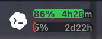

# Codex Quota Menu Bar

A small, native macOS menu bar app that shows the remaining quota reported by
local Codex session logs. Current release: **v3.0**.

The Codex icon and compact color-coded bars show the remaining quota for the
available usage windows together with their reset times. Open the menu to choose
up to two displayed windows, view full details, refresh manually, or change the
start-at-login setting.



## Privacy

The app works entirely offline. It does not use the network, transmit session
contents, or require an API key. It only reads Codex's local session logs:

- `~/.codex/sessions/**/*.jsonl`
- `~/.codex/archived_sessions/*.jsonl`

## Requirements

- macOS 13 or newer
- Apple Silicon Mac

Building from source additionally requires the Xcode command line tools with
`swiftc`.

## Install a release

1. Download the latest `CodexQuotaMenuBar-*-macOS.zip` from GitHub Releases.
2. Unzip it and move `CodexQuotaMenuBar.app` to `Applications`.
3. Open the app. Its quota indicator will appear in the menu bar.

The release is ad-hoc signed rather than notarized. If macOS blocks the first
launch, right-click the app, choose **Open**, and confirm.

## Build from source

```bash
git clone https://github.com/PlutaB/codex-quota-menubar.git
cd codex-quota-menubar
./build.sh
```

The app bundle is written to:

```text
build/CodexQuotaMenuBar.app
```

## Run

```bash
./run.sh
```

On first launch, the app enables start-at-login by writing a LaunchAgent that
points to the current `.app` path:

```text
~/Library/LaunchAgents/com.bowen.codex-quota-menubar.plist
```

## Check From Terminal

```bash
./build/CodexQuotaMenuBar.app/Contents/MacOS/CodexQuotaMenuBar --once
```

## Start At Login

```bash
./install_launch_agent.sh
```

This writes `~/Library/LaunchAgents/com.bowen.codex-quota-menubar.plist` and starts the app.

## Remove Login Item

```bash
./uninstall_launch_agent.sh
```

This removes the LaunchAgent but leaves the app itself in place.

## Create a release package

```bash
./package_release.sh
```

The distributable zip is written to:

```text
dist/CodexQuotaMenuBar-3.0.0-macOS.zip
```

Generated builds and release archives are intentionally excluded from Git.

## Author

[**PlutaB**](https://github.com/PlutaB)

Adapted from [BowenZZZZZZZ/codex-quota-menubar](https://github.com/BowenZZZZZZZ/codex-quota-menubar)

## License

Copyright © 2026 PlutaB.

Licensed under the [MIT License](LICENSE).
